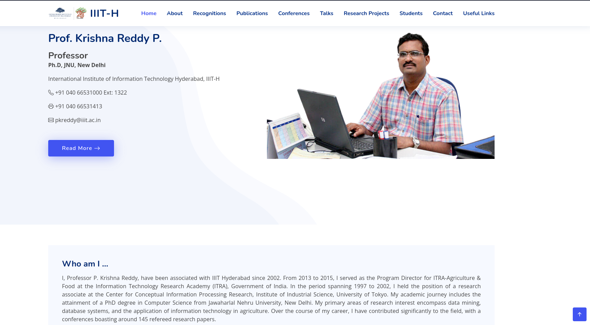

# Website Publishing Instructions

Follow these steps to publish the website:

## 1. Clone the Code

Clone the code from the provided Git repository link:

```bash
$ git clone https://github.com/vilalali/public_html.git
```
## 2. Copy the Clone Code
```bash
$ cp -r public_html /var/www/html/

$ cd /var/www/html/public_html

Default root file is "index.html" inside the folder public_html.
Replace complete directory from the exiting public_html.
```

<video width="768" height="315" controls>
  <source src="assets/krishnaSirProfileDemo.mp4" type="video/mp4">
</video>

[](https://www.youtube.com/watch?v=Hc79sDi3f0U "Now in Android: 55")


### About This Project

Feel free to contribute and provide feedback.

© 2023 Vilal Ali. All rights reserved.
